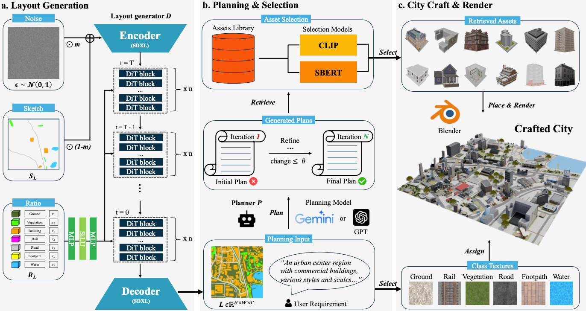
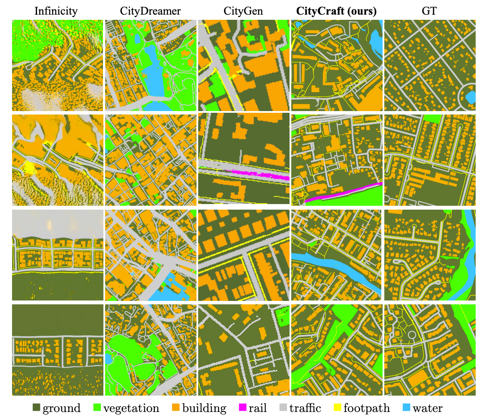
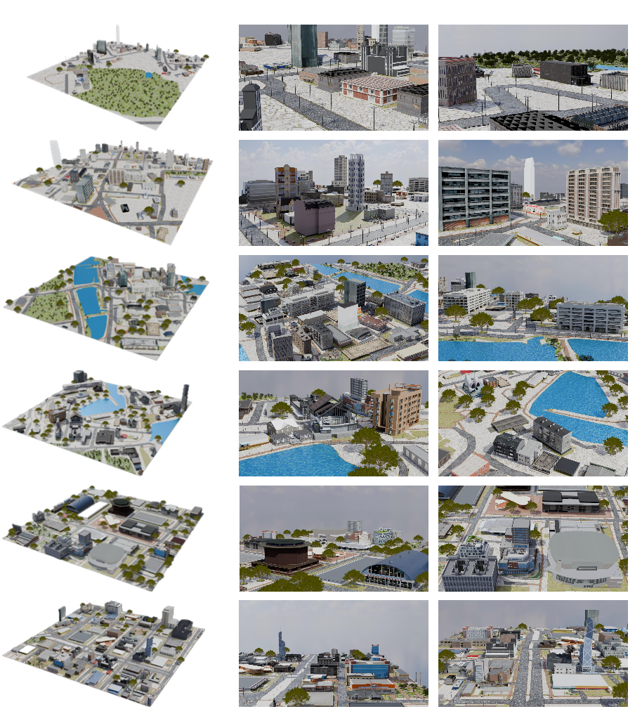

# CityCraft

This is the official codebase for ***CityCraft***: **A Diffusion and LLM Powered Framework for Automatic Comprehensive Virtual City Generation**.



## System Requirements

Development environment:
- **OS**: Ubuntu 22.04
- **CUDA**: 11.7
- **PyTorch**: 2.0.1

## Environment Setup

Create a new environment and install the requirements:
```bash
conda create -n citycraft python=3.10
conda activate citycraft
pip install -r requirements.txt
```

## Prepare Datasets

### a. Layout Generation Dataset

Step 1: Download osm data from "https://huggingface.co/datasets/GearlessJ333/CityCraft/tree/main" and put it in the folder "**CityCraft/dataset/CityCraft_OSM/**"

```bash
cd dataset
unzip layouts.zip
```

After this step, you will the the following structure:

```
CityCraft/
    dataset/
        CityCraft_OSM/
            layouts/
                1.png
                2.png
                3.png
                ...
```


Step 2: prepare training features

```bash
cd dataset/extract_features
python extract_ratio_features.py
```

This will exract latent image features and ratio features for training. After this step, you will have the following structure:   
```
CityCraft_OSM/
    layouts/
    features/
        image_ratio_features/
```

### b. Assets Dataset

Step 1: Download assets data from "https://huggingface.co/datasets/GearlessJ333/CityCraft/tree/main" and put it in the folder "**CityCraft/dataset/city_render/**"

Step 2: Unzip data and features

```bash
cd dataset/CityCraft_Buildings
unzip assets.zip
```
This will extract the assets data and features. After this step, you will have the following structure:

```
CityCraft_Buildings/
    assets/
        assets_features/
        assets_filtered/
        assets_renders/
```


## Stage 1: Layout Generation

### Train

Our layout generation model is a diffusion transformer [DiT](https://arxiv.org/abs/2212.09748). Specifically, we used **DiT-B/2** and our training script is developed upon [FastDiT](https://github.com/chuanyangjin/fast-DiT). 


```bash
cd layout_generation
python accelerate launch --multi_gpu --num_processes 4 --mixed_precision bf16 train.py --model DiT-B/2 --ckpt-every-epoch 10 --global-batch-size 256  --lr 1e-5 
```

You can adjust all training parameters on your need. You also need to config [Accelerator](https://huggingface.co/docs/accelerate/en/package_reference/accelerator) before training.

The training results will be stored in your designated **'results-dir'**.

You can login to [Weight and Biases](https://wandb.ai/site/) to monitor the training process.


### Inference

Step 1: Download pretrained model from "https://huggingface.co/GearlessJ333/CityCraft/tree/main" and put it in the folder "**CityCraft/pretrained_models/**"

Step 2: Sample from pretrained models
```bash
cd layout_generation
python sample_uncondition.py
```

Step 3: Post-process the generated layouts

```bash
cd layout_generation
python utils/post_process.py
```




## Stage 2: Urban Planning

step 1 (optional): put your selected layout images in the folder "**urban_planning/layouts/**", and **modify llm_planning.sh** to set planning target and requirements.

step 2: set API key in **llm_planning.sh**
```
api_key = 'your_api_key'
```
You need an API key for OpenAI models, you can get one from [here](https://platform.openai.com/api-keys).


step 3: start planning
```bash
cd urban_planning
sh llm_planning.sh
```
After step, the plan will be generated in the folder "**urban_planning/planning_result/**" at the output directory you set in **llm_planning.sh**.


**Example Plan Output:**

```json
{
    "0": {
        "location": [
            23,
            0,
            17,
            15
        ],
        "x": 8.5,
        "y": 7.5,
        "neighbors": [
            1,
            9,
            18,
            21,
            26
        ],
        "description": "A mid-rise residential building with children's playground ",
        "function_primary": " residential ",
        "function_secondary": " children's playground ",
        "scale": " mid-rise ",
        "style": " modern ",
        "num_floor": 5,
        "reason": " Positioned away from traffic roads and complements nearby residential areas while fulfilling user requirements for housing and recreational spaces.",
        "distance_to_roads": [
            9.848857801796104
        ]
    },
    "1": {
        "location": [
            23,
            40,
            20,
            50
        ],
        "x": 25.0,
        "y": 10.0,
        "neighbors": [
            0,
            9,
            3,
            18,
            21
        ],
        "description": "A three-story residential building with modern amenities ",
        "function_primary": " residential ",
        "function_secondary": " community space ",
        "scale": " mid-rise ",
        "style": " modern ",
        "num_floor": 3,
        "reason": " Satisfies user requirements for residential buildings, maintains a safe distance from traffic roads, and reflects the desired architectural style.",
        "distance_to_roads": [
            1.0
        ],
        "required_type": "residential buildings"
    },

    ...
```


step 4: select assets

In "**select_buildings.sh**", set the path to the planning result you want to select assets from, then run:

```bash
sh select_buildings.sh
```

After this step, .pkl file containing the selected assets will be generated in the folder, for example: ***CityCraft/urban_planning/planning_result/layout_1/selected_buildings.pkl***.


## Stage 3: Blender Rendering


step 1: Download Blender Installer

Go back to the root directory **CityCraft/**:

```bash
mkdir Blender
```


Download Blender from [here](https://download.blender.org/release/Blender4.0/), please select the version that matches your operating system, and put it in the folder "**CityCraft/Blender/**".    

(For example, we used [here](https://download.blender.org/release/Blender4.0/) to install Blender 4.0.0 for our Linux x86_64 system;  ***You can put it anywhere but just remember to set the path later when you run the rendering script.***)

step 2: Install Blender
```bash
cd Blender
tar -xJvf blender-4.0.2-linux-x64.tar.xz
```

step 3: Download extra assets and textures

Download extra assets and textures from "https://huggingface.co/GearlessJ333/CityCraft/tree/main" and put it in the folder "**CityCraft/render_scene/**"

```bash
cd render_scene
unzip extra_assets.zip
unzip textures.zip
```

After this step, you will have the following structure:

```
render_scene/
    extra_assets/
    textures/
```

step 4: Start Rendering

Note: You need to set the path to the layout image and the selected assets pkl file in the **render_scene.sh** file. You also need to set the path to the Blender executable file to where you installed it. 

```bash
cd render_scene
sh render_scene.sh
```

After this step, you will have the rendered scenes in the folder "**render_scene/rendered_scenes/**".

**Sample Scenes:**



If you feel our work is helpful, please consider citing:

```bibtex
@article{deng2024citycraft,
  title={CityCraft: A Real Crafter for 3D City Generation},
  author={Deng, Jie and Chai, Wenhao and Huang, Junsheng and Zhao, Zhonghan and Huang, Qixuan and Gao, Mingyan and Guo, Jianshu and Hao, Shengyu and Hu, Wenhao and Hwang, Jenq-Neng and others},
  journal={arXiv preprint arXiv:2406.04983},
  year={2024}
}
``` 